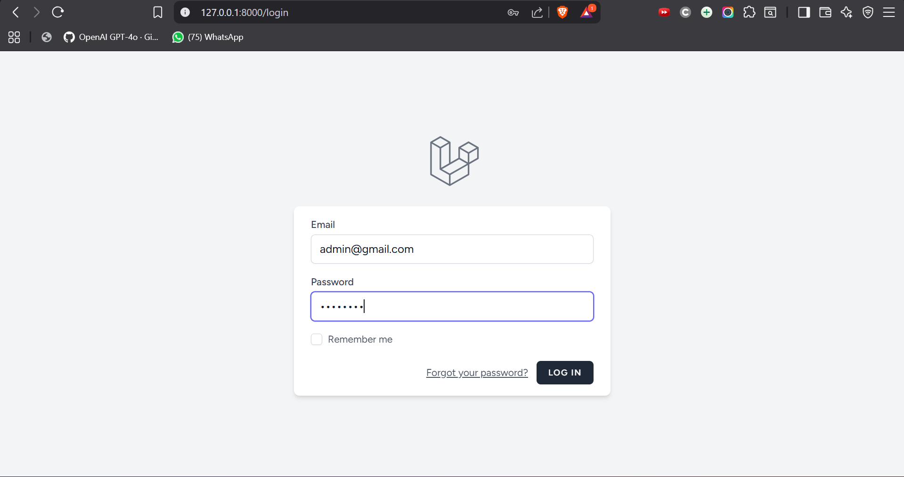
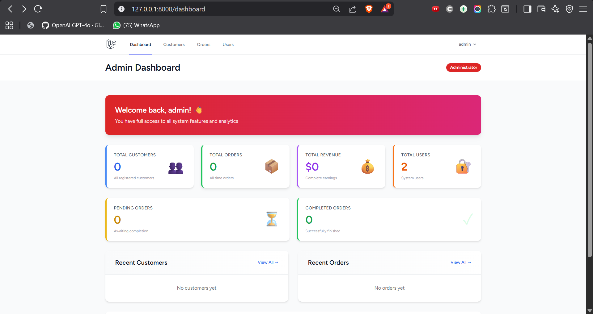
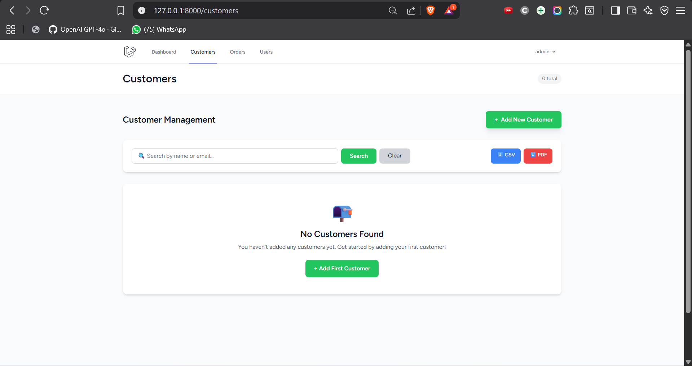
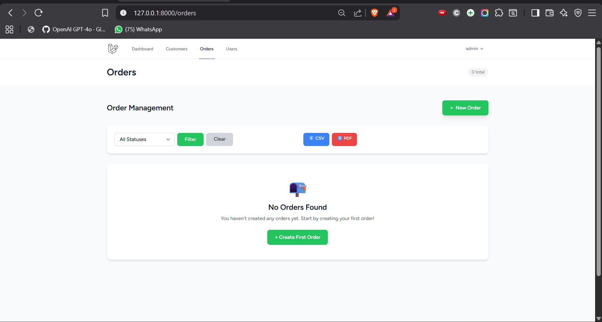
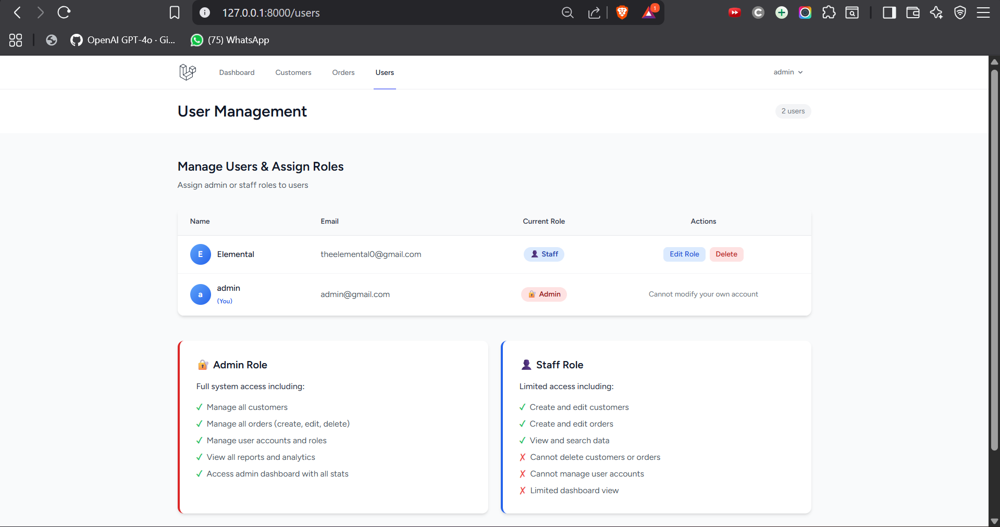

# ImpactGuru Mini CRM – A Customer Management System

## Project Overview

ImpactGuru Mini CRM is a modern, role-based customer management application built with **Laravel 11** and **Tailwind CSS**. It demonstrates practical experience with Laravel fundamentals including authentication, routing, Eloquent ORM, Blade templating, file uploads, middleware, notifications, and REST APIs — along with version control using GitHub.

The application manages customers, their orders, and provides role-based access (Admin/Staff) with comprehensive CRUD operations, data export capabilities, and a beautiful, responsive user interface.

---

## 🚀 Key Features

### 1. **Authentication Module**
- User registration, login, and password reset using **Laravel Breeze**
- Restrict access using auth middleware
- **Role-Based Access Control (RBAC)** with Admin and Staff roles
  - **Admin**: Full system access (manage customers, orders, users, delete operations)
  - **Staff**: Limited access (create/edit customers & orders, cannot delete or manage users)
- Middleware to restrict admin-only routes

### 2. **Customer Management Module**
- Full CRUD operations for customers
- Customer model with fields: `name`, `email`, `phone`, `address`, `profile_image`
- **Profile image upload and display**
- Form validation for all inputs
- Pagination for customer listings (10 items per page)
- **Soft deletes** for safe data removal
- Search functionality by name or email
- Export customers as **CSV** or **PDF**

### 3. **Order Management Module**
- Create orders linked to customers (one-to-many relationship)
- Order fields: `order_number`, `amount`, `status` (Pending/Completed/Cancelled), `order_date`
- Display all orders with customer details
- **Role-based restrictions** (only admins can delete orders)
- Pagination for order listings
- Status filtering (by Pending, Completed, Cancelled)
- Export orders as **CSV** or **PDF**

### 4. **Search & Filtering**
- Search bar to find customers by name or email
- Filter orders by status
- Real-time data retrieval with optimized Eloquent queries

### 5. **Dashboard**
- **Role-Based Dashboards**:
  - **Admin Dashboard**: Shows total customers, orders, revenue, users, pending/completed orders, recent activity
  - **Staff Dashboard**: Shows total customers, orders, pending orders, recent customers, and permission summary
- Key statistics with visual cards and icons
- Recent customers and orders tables
- Quick action buttons for common tasks

### 6. **REST API**
- Complete API routes with Sanctum token authentication:
  - `GET /api/customers` - List all customers
  - `GET /api/customers/{id}` - Get customer details
  - `POST /api/customers` - Create customer
  - `PUT /api/customers/{id}` - Update customer
  - `DELETE /api/customers/{id}` - Delete customer (admin only)
- Protected with **Laravel Sanctum** (API Token Authentication)
- Apply role-based access (only admins can delete)

### 7. **User Management** (Admin Only)
- View all system users
- Assign/change user roles (Admin/Staff)
- Delete user accounts
- User management page accessible only to admins

### 8. **Error Handling & Validation**
- Form request validation for all inputs
- Display validation errors on forms
- Custom error pages for 404/500 errors
- Application error logging in `storage/logs/laravel.log`

### 9. **Version Control & GitHub**
- Git repository with meaningful commits
- All code pushed to public GitHub repository
- Detailed README with setup instructions

---

## 📋 Role Permissions Summary

| Feature | Admin | Staff |
|---------|-------|-------|
| View Customers | ✅ | ✅ |
| Create Customers | ✅ | ✅ |
| Edit Customers | ✅ | ✅ |
| Delete Customers | ✅ | ❌ |
| View Orders | ✅ | ✅ |
| Create Orders | ✅ | ✅ |
| Edit Orders | ✅ | ✅ |
| Delete Orders | ✅ | ❌ |
| Manage Users | ✅ | ❌ |
| Assign Roles | ✅ | ❌ |
| View Admin Dashboard | ✅ | ❌ |
| View Staff Dashboard | ❌ | ✅ |
| Export Data (CSV/PDF) | ✅ | ✅ |

---

## 🛠️ Technical Requirements

| Component | Requirement |
|-----------|-------------|
| **Laravel** | 11.x or latest |
| **PHP** | >= 8.1 |
| **Database** | MySQL 5.7+ |
| **Frontend** | Blade / Tailwind CSS |
| **Authentication** | Laravel Breeze |
| **Authorization** | Role-Based Middleware |
| **Notifications** | Laravel Notifications |
| **API Security** | Laravel Sanctum |
| **Version Control** | Git + GitHub |

---

## 📥 Installation Steps

### Prerequisites
- PHP >= 8.1
- Composer
- MySQL 5.7+
- Node.js & npm

### Setup Instructions

1. **Clone the Repository**
   ```bash
   git clone https://github.com/yourusername/impactguru-crm.git
   cd impactguru-crm
   ```

2. **Install Dependencies**
   ```bash
   composer install
   npm install
   ```

3. **Environment Configuration**
   ```bash
   cp .env.example .env
   ```
   Edit `.env` with your database credentials:
   ```
   DB_CONNECTION=mysql
   DB_HOST=127.0.0.1
   DB_PORT=3306
   DB_DATABASE=impactguru_crm
   DB_USERNAME=root
   DB_PASSWORD=mysql123
   ```

4. **Generate Application Key**
   ```bash
   php artisan key:generate
   ```

5. **Setup Database - Choose One Method**

   **Option A: Using Migrations (Recommended)**
   ```bash
   php artisan migrate
   ```

   **Option B: Using Database Dump**
   ```bash
   mysql -h 127.0.0.1 -u root -pmysql123 impactguru_crm < database.sql
   ```
   First create the database:
   ```bash
   mysql -h 127.0.0.1 -u root -pmysql123 -e "CREATE DATABASE IF NOT EXISTS impactguru_crm;"
   ```

6. **Build Frontend Assets**
   ```bash
   npm run build
   ```

7. **Start Development Server**
   ```bash
   php artisan serve
   ```

   Application will be available at `http://127.0.0.1:8000`

### Demo Credentials

After running migrations, use these credentials to log in:

- **Email**: admin@gmail.com
- **Password**: admin123

**Note**: The first registered user automatically becomes an **Admin**. Subsequent users are assigned the **Staff** role.

### User Registration & Role Assignment

- **First User**: Automatically becomes **Admin** 🔐
- **Subsequent Users**: Automatically assigned **Staff** 👤
- **Admin** can manage roles via `/users` page

---

## 🎬 Screenshots

### Login Page

Clean authentication interface with email and password fields. Supports remember me and password reset.

### Admin Dashboard

Comprehensive admin overview showing key metrics: total customers, orders, revenue, system users, pending/completed orders, and recent activity.

### Customer Management

Customer listing with search functionality, pagination, export to CSV/PDF, and quick actions to add, edit, or delete customers.

### Order Management

Order listing with status filtering (Pending/Completed/Cancelled), export capabilities, and ability to create new orders linked to customers.

### User Management (Admin Only)

Role assignment interface showing all system users with current roles, ability to edit roles, and clear documentation of admin vs staff permissions.

---

## 📂 Project Structure

```
impactguru-crm/
├── app/
│   ├── Http/
│   │   ├── Controllers/
│   │   │   ├── DashboardController.php
│   │   │   ├── CustomerController.php
│   │   │   ├── OrderController.php
│   │   │   ├── UserController.php
│   │   │   └── ExportController.php
│   │   ├── Middleware/
│   │   │   └── IsAdmin.php
│   │   └── Requests/
│   │       ├── StoreCustomerRequest.php
│   │       └── UpdateCustomerRequest.php
│   ├── Models/
│   │   ├── User.php (with role attribute)
│   │   ├── Customer.php (with soft deletes)
│   │   └── Order.php
│   └── Console/
│       └── Commands/
│           └── PromoteToAdmin.php
├── routes/
│   ├── web.php
│   └── auth.php
├── resources/
│   ├── views/
│   │   ├── dashboard/
│   │   │   ├── admin.blade.php (admin-only dashboard)
│   │   │   └── staff.blade.php (staff-only dashboard)
│   │   ├── customers/ (CRUD views)
│   │   ├── orders/ (CRUD views)
│   │   ├── users/ (admin user management)
│   │   ├── layouts/
│   │   └── auth/
│   └── css/
│       └── app.css (Tailwind)
├── database/
│   ├── migrations/
│   ├── seeders/
│   └── factories/
├── bootstrap/
│   └── app.php
├── .env.example
└── README.md
```

---

## 🗄️ Database Schema

### Users Table
- `id` - Primary key
- `name` - User name
- `email` - Unique email
- `password` - Hashed password
- `role` - Enum: 'admin' or 'staff'
- `timestamps` - created_at, updated_at

### Customers Table
- `id` - Primary key
- `name` - Customer name
- `email` - Customer email
- `phone` - Contact number
- `address` - Customer address
- `profile_image` - Image path
- `deleted_at` - Soft delete timestamp
- `timestamps` - created_at, updated_at

### Orders Table
- `id` - Primary key
- `customer_id` - Foreign key to customers
- `order_number` - Unique order number
- `amount` - Order amount (decimal)
- `status` - Enum: 'Pending', 'Completed', 'Cancelled'
- `order_date` - Date of order
- `timestamps` - created_at, updated_at

---

## 🔌 REST API Endpoints

All endpoints require **Sanctum API Token** in header:
```
Authorization: Bearer YOUR_API_TOKEN
```

### Customers
- `GET /api/customers` - List all
- `GET /api/customers/{id}` - Get details
- `POST /api/customers` - Create
- `PUT /api/customers/{id}` - Update
- `DELETE /api/customers/{id}` - Delete (admin only)

### Orders
- `GET /api/orders` - List all
- `GET /api/orders/{id}` - Get details
- `POST /api/orders` - Create
- `PUT /api/orders/{id}` - Update
- `DELETE /api/orders/{id}` - Delete (admin only)

---

## 📦 Project Completion Checklist

✅ All 10 modules implemented  
✅ Source code included  
✅ `.env.example` file provided  
✅ `README.md` with full documentation  
✅ Database migrations for all tables  
✅ Role-based access control working  
✅ Git repository initialized and pushed to GitHub  
✅ Frequent, meaningful commits  
✅ Admin and Staff dashboards implemented  
✅ User management system for role assignment  

---

## 🎯 What's Delivered

1. ✅ **Authentication** - Login, register, password reset
2. ✅ **Customer Management** - CRUD, search, profile images, pagination
3. ✅ **Order Management** - CRUD, status filtering, customer linking
4. ✅ **Search & Filtering** - Real-time customer search and order status filter
5. ✅ **Dashboard** - Role-based views with statistics and recent activity
6. ✅ **REST API** - Sanctum-protected full CRUD endpoints
7. ✅ **User Management** - Admin-only role assignment interface
8. ✅ **Export** - CSV and PDF downloads for customers and orders
9. ✅ **Error Handling** - Form validation, error pages, logging
10. ✅ **Version Control** - Git with meaningful commits, GitHub-ready

---

## 🚀 Deployment

For production deployment:

1. Set `APP_DEBUG=false` in `.env`
2. Configure proper database credentials
3. Set email credentials for notifications
4. Run migrations: `php artisan migrate --force`
5. Build assets: `npm run build`
6. Clear config cache: `php artisan config:cache`

---

## 📄 License

Open source project - MIT License

---

**Project Completed**: December 22, 2025  
**Submission**: Complete with GitHub repository link
